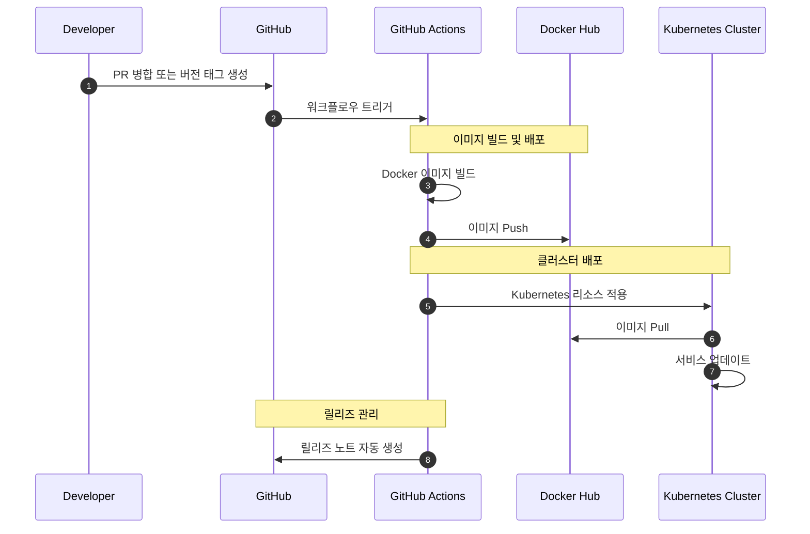

# Proejct JARVIS

반복적인 일간, 주간 알림의 자동화 및 기타 편의 기능을 제공하는 슬랙 봇 서비스 프로젝트.

## 코드 테스트 및 점검

PR을 생성했을 때 GitHub Action에서 아래 항목들에 대해 자동으로 수행하며,<br>
모두 패스해야 main 브랜치에 merge 할 수 있습니다.

```shell
# go 단위 테스트를 실행한다.
go test -v ./...

# go 통합 테스트를 실행한다.
INTEGRATION_TEST=on go test -v ./...
```

### [golangci-lint](https://github.com/golangci/golangci-lint)

```shell
# linter를 사용해 go 코드를 점검한다.
golangci-lint run
```


## CI/CD 구성

프로젝트는 GitHub Actions를 통한 자동화된 CI/CD 파이프라인을 구성하고 있습니다.

### 트리거 조건

다음 두 가지 조건에서 자동으로 CI/CD 파이프라인이 실행됩니다:

- **PR 병합**: main 브랜치로 PR이 병합될 때
- **버전 태그**: `v1.0.0` 형식의 버전 태그가 생성될 때

### 파이프라인 프로세스

1. **파이프라인 트리거**: PR 병합, 버전 태그 생성
2. **이미지 빌드**: 각 서비스별 Docker 이미지 빌드
3. **이미지 배포**: Docker Hub로 이미지 푸시
4. **클러스터 배포**: Kubernetes 클러스터에 변경사항 반영
5. **릴리즈**: 변경사항을 포함한 GitHub 릴리즈 자동 생성

### 워크플로우 다이어그램


